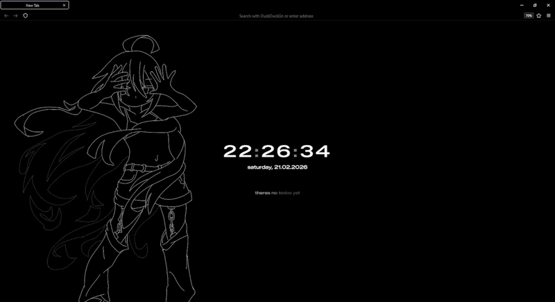

# Custom New-Tab
> Firefox extention that allows you to create your own page and set it as a "new tab" page.

## How it works
Extension uses its internal pages for rendering by default. So, if you want to change your newbuilt extension even a little bit - you have to rebuilt it (or open it as zip and edit).

### Default page
The default page in `./page/` written using `vue` + `vite`.
It's have some features: 
 - Date & time(with cool digit transitions)
 - To-do list(works across tabs via `Pinia` stores) (click to your To-do to delete it)
 - Wallpapers shuffle on reload(or new tab) (wallpapers that in `./page/wallpapers/`, so you can just drop pictures in this folder)

**Preview:**

## Customize
To replace default page with your own you should:
1. Replace `./src/page/` to your rendered page
2. Zip entire `./src/` folder in `*.xpi` archive
It's content should look like:\
`my-archive@me.xpi`\
 | - `manifest.json`\
 | - `page/`\
 | + - `index.html`
3. Move archive into Firefox's window to import your extension.
If previous version of extension was already imported - firefox will replace it